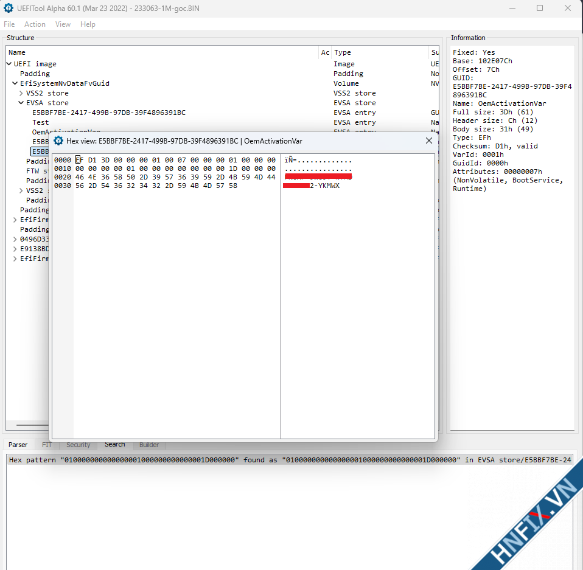
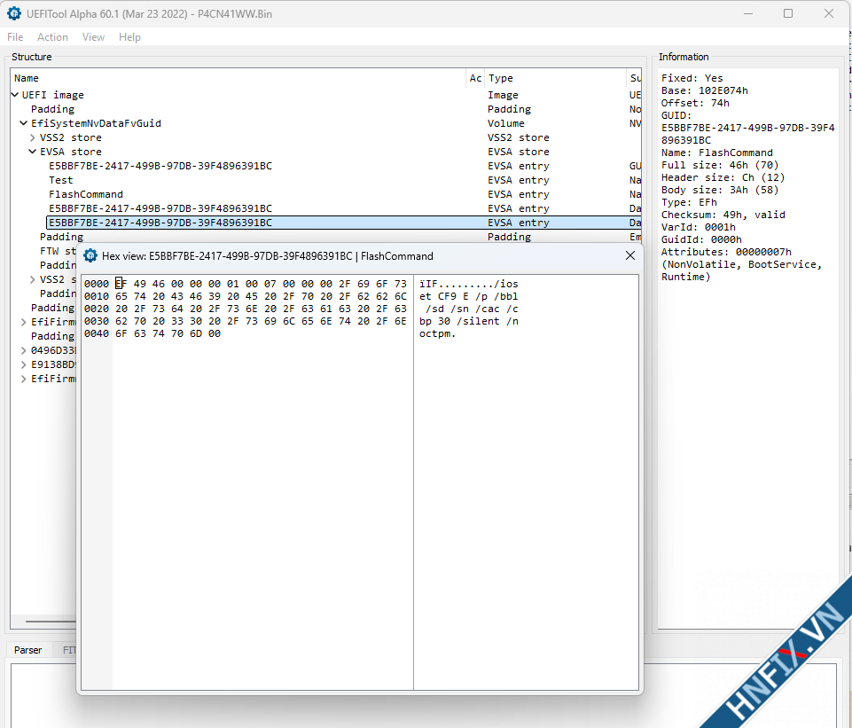

# Hướng Dẫn Giữ Lại Key Windows OEM Khi Nạp BIOS Mới Cho Laptop​

Vấn đề bản quyền Windows đang được siết chặt khá căng thẳng. Hãy tưởng tượng một tình huống: Khách mang máy có sẵn Windows bản quyền theo máy (Key OEM) đến sửa, chúng ta nạp BIOS mới nhưng vô tình làm mất Key, biến máy của khách thành máy "Free DOS" (không bản quyền). Điều này vừa gây thiệt thòi cho khách, vừa đẩy chính chúng ta hoặc khách hàng vào rủi ro pháp lý, có thể bị phạt oan uổng khi bị kiểm tra hành chính

Bài viết này mình sẽ hướng dẫn anh em cách kiểm tra và chuyển Key Windows OEM từ BIOS cũ sang BIOS mới một cách đơn giản nhất

> Lưu ý: Đối với BIOS mới (BIOS clear me, BIOS hãng), có những bản hãng đã tích hợp sẵn Key, nhưng cũng có những bản hoàn toàn "trắng" Key, bắt buộc chúng ta phải làm thủ công

## Bước 1: Cách nhận biết đoạn mã chứa Key Windows trong BIOS​

Dù là máy của hãng nào (Dell, HP, ThinkPad, Asus...), cấu trúc khai báo Key Windows OEM trong file BIOS luôn luôn bắt đầu bằng một chuỗi mã Hex cố định sau:

```
01 00 00 00 00 00 00 00 01 00 00 00 00 00 00 00 1D 00 00 00
```

Để kiểm tra xem file BIOS đã có Key hay chưa, anh em chỉ cần:

1. Mở file BIOS cũ (hoặc mới) bằng các công cụ như Hex Editor (HxD) hoặc UEFI Tool
2. Sử dụng tính năng Tìm kiếm (Search/Find) theo chuỗi Hex bên trên
3. Nếu tìm thấy, ngay phía sau chuỗi Hex đó sẽ là dãy 25 ký tự Key Windows OEM của máy

## Bước 2: Cách xử lý cho từng trường hợp​

Tùy vào cấu trúc thiết kế của từng hãng, vị trí lưu trữ Key sẽ khác nhau. (Ví dụ: Như trong hình của mình, đoạn khai báo Key nằm trong vùng EVSA Store; các dòng máy khác có thể nằm ở vùng khác nên anh em cần quan sát kỹ)



### Trường hợp 1: BIOS mới đã có sẵn Key​

Nếu tìm thấy chuỗi Hex và có sẵn Key hợp lệ trong BIOS mới -> Anh em có thể bỏ qua và tiến hành nạp luôn

### Trường hợp 2: BIOS mới chưa có Key (BIOS trắng)​

Nếu tìm kiếm chuỗi Hex trên BIOS mới mà không ra kết quả, tức là file này chưa được nạp Key. Chúng ta cần copy Key từ BIOS cũ sang



## Bước 3: Mẹo copy Key an toàn (Dành cho anh em không chuyên sâu về cấu trúc BIOS)​

Việc chỉ copy riêng chuỗi 25 ký tự Key rất nguy hiểm nếu bạn không quen tay. Nó không chỉ dễ làm lệch cấu trúc file (gây lỗi Corrupt BIOS, mất nguồn, không boot...) mà còn thiếu đi phần khai báo kích hoạt (Token/Digital Product Policy) của hãng. Kết quả là máy vẫn không thể tự kích hoạt bản quyền được

Do đó, giải pháp an toàn, nhanh chóng và chuẩn bài nhất là thay thế cả mảng (Block/Region) chứa Key:

1. Tìm và xác định toàn bộ phân vùng chứa Key ở file BIOS cũ (Ví dụ: Vùng EVSA Store hoặc DPP tùy dòng máy)
2. Copy (sao chép) nguyên cả mảng (Block/Region) đó từ BIOS cũ
3. Paste (ghi đè) hoàn toàn vào đúng vị trí phân vùng tương ứng trên file BIOS mới
4. Lưu lại (Save) file BIOS mới

## Kết quả​

Bây giờ, anh em chỉ việc nạp file BIOS mới đã được mod này vào mainboard. Khi máy khởi động và lên nguồn, Windows sẽ tự động nhận diện Key OEM từ BIOS và kích hoạt bản quyền (Activated) một cách hoàn toàn hợp pháp và chuẩn chỉ

cre: thanhluan119 - hnfix.vn