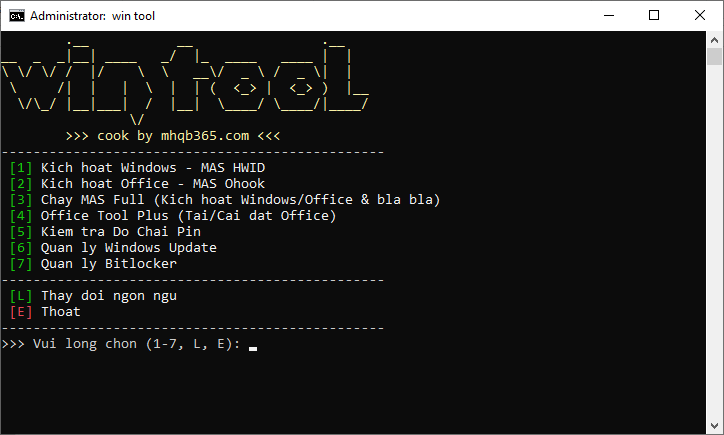

# win tool

🇻🇳 Sao chép dòng lệnh dưới đây, mở **Terminal** hoặc **PowerShell** với quyền Admin, dán vào và enter. Khi menu hiện lên thì chọn chức năng bằng cách bấm các phím số tương ứng.

🇺🇸 Copy the command below, open **Terminal** or **PowerShell** as Admin, paste and enter. When the menu appears, select the function by pressing the corresponding number keys.

```
irm https://mhqb365.com/win | iex
```


